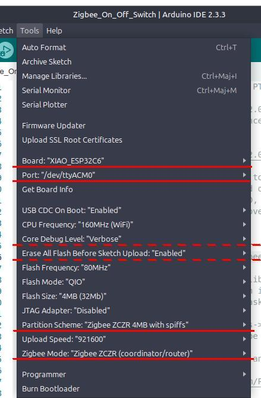

# Arduino-ESP32 Zigbee On/Off Switch Example

This example shows how a XIAO ESP32C6 or XIAO ESP32C5 can be a Zigbee Coordinator and to use it as a Home Automation (HA) on/off light switch.

**The original README was renamed [README-org.md](README-org.md)**

---

**Table of Content**

<!-- TOC -->

- [1. Supported Targets](#1-supported-targets)
- [2. Hardware Required](#2-hardware-required)
- [3. Configure the Project](#3-configure-the-project)
- [4. Compiling and Uploading the Sketch](#4-compiling-and-uploading-the-sketch)
  - [4.1. Using Arduino IDE](#41-using-arduino-ide)
  - [4.2. Using pioarduino IDE](#42-using-pioarduino-ide)
- [5. Connecting a Zigbee On Off Light to this Zigbee Coordinator](#5-connecting-a-zigbee-on-off-light-to-this-zigbee-coordinator)

<!-- /TOC -->
---

## 1. Supported Targets

Currently, this example supports the following targets.

| Supported SoCs | ESP32-C5 |ESP32-C6 | ESP32-H2 |
| --- | --- | --- | --- |

## 2. Hardware Required

* A development board (ESP32-H2, ESP32-C6 or ESP32-C5 based) acting as a Zigbee coordinator (running the Zigbee_On_Off_Switch example).

* Another development board (ESP32-H2, ESP32-C6 or ESP32-C5 based) acting as a Zigbee end device (running the Zigbee_On_Off_Light example).

* 5 volt power supplies for the two boards and USB cables for power supply and programming.

## 3. Configure the Project

The sketch should work as is if uploaded to a Seeed Studio [XIAO ESP32C6](https://www.seeedstudio.com/Seeed-Studio-XIAO-ESP32C6-p-5884.html) or [XIAO ESP32C5](https://www.seeedstudio.com/Seeed-Studio-XIAO-ESP32C5-p-6609.html). If using a XIAO ESP32C6 with a connected external antenna, please define the USE_EXTERNAL_ANTENNA macro near the beginning of the source code in the `/////// User configuration ////` section. The other options in that section 

The project may work with other development boards based on a supported SoC. There are macros in the ///<User settable macros> section at the beginning of the source code that can be used to override automatic definitions valid for the XIAO boards.

## 4. Compiling and Uploading the Sketch

### 4.1. Using Arduino IDE

Before Compile/Verify, go to the `Tools` menu to modify the following options.

**XIAO ESP32C6**

* Select the correct **Board** (example: *"XIAO_ESP32C6"*).
* Select the correct **Port** (examples: *"/dev/ttyACM0"* in Linux, *"Com4"* in Windows).
* Set the **Partition Scheme** to *"Zigbee ZCZR 4MB with spiffs"*.
* Set the **Zigbee mode** *"Zigbee ZCZR (coordinator/router)"*.
* Optional: Set **Core Debug Level** to the desired level such as *"Verbose"* (default is *"None"*).
* Optional: Set **Erase All Flash Before Sketch Upload** to *"Enabled"* (default is *"Disabled"*).



**XIAO ESP32C5**

* Select the correct **Board** (example: *"XIAO_ESP3256"*).
* Select the correct **Port** (examples: *"/dev/ttyACM0"* in Linux, *"Com4"* in Windows).
* Set the **Partition Scheme** to *"Zigbee ZCZR 8MB with spiffs"*.
* Set the **Zigbee mode** *"Zigbee ZCZR (coordinator/router)"*.
* Optional: Set **Core Debug Level** to the desired level such as *"Verbose"* (default is *"None"*).
* Optional: Set **Erase All Flash Before Sketch Upload** to *"Enabled"* (default is *"Disabled"*).

Same as for the XIAO ESP32C6 except for the bigger partition scheme.

### 4.2. Using pioarduino IDE

The sketch was successfully compiled with version 55.03.36 of the  [pioarduino-espressif32](https://github.com/pioarduino/platform-espressif32) platform released on January 21, 2026. The platform does not contain a board definition for the XIAO ESP32C5. A board definition, named [seeed_xiao_esp32c5.json](boards/seeed_xiao_esp32c5.json), is provided in the `boards` directory. See the [README](../../../boards/README.md) about the source of that definition.

This was tested using the [pioarduinoIDE extension](https://marketplace.visualstudio.com/items?itemName=pioarduino.pioarduino-ide) (v1.2.5) which is a fork of the PlatformioIDE extension in [VSCodium](https://vscodium.com/) (Version: 1.108.10359) which is itself a fork of Visual Studio Code.

```ini
[platformio]
default_envs = seeed_xiao_esp32c5
;default_envs = seeed_xiao_esp32c6

; Make the Arduino IDE happy (.INO file must be in a directory of the same name)
src_dir = Zigbee_On_Off_Switch
boards_dir = ../../boards   ;; .../xiao_esp32c5_sketches/boards/
lib_dir = ../../libraries   ;; .../xiao_esp32c5_sketches/libraries/

[env]
platform = https://github.com/pioarduino/platform-espressif32/releases/download/stable/platform-espressif32.zip
framework = arduino
build_flags = 
  -D ZIGBEE_MODE_ZCZR
  ;-D CORE_DEBUG_LEVEL=0 ; 0: none, 1: critical, 2: error, 3: info, 4: debug, 5: verbose         
;upload_port = /dev/ttyACM0
;monitor_port = /dev/ttyACM0

[env:seeed_xiao_esp32c5]
board = seeed_xiao_esp32c5
board_build.partitions = zigbee_zczr_8MB.csv
monitor_speed = 460800

[env:seeed_xiao_esp32c6]
board = seeed_xiao_esp32c6
board_build.partitions = zigbee_zczr.csv
monitor_speed = 460800                 
```

For core debugging, uncomment `-D CORE_DEBUG_LEVEL=x` in `build_flags` and set `x` to the desired level. By default, the level is 0.

## 5. Connecting a Zigbee On Off Light to this Zigbee Coordinator

Power up the development board running the `Zigbee_On_Off_Switch` sketch. The `setup()` routine 
  - opens the network allowing end device to join for 180 seconds with the `Zigbee.setRebootOpenNetwork()` method,

  - starts Zigbee in coordinator mode,

  - enters a loop waiting for a light end device to connect.

Power up the development board running the `Zigbee_On_Off_Light` sketch. Make sure the boards are very near each other to avoid interference from other running Zigbee devices and coordinators. See section **5. Connecting to a Zigbee Coordinator** in the README.md file of the Zigbee_On_Off_Light project for more details.

After a short while, the end device (...Light) should have joined the Zigbee network created by the coordinator (...Switch). The serial output of the two devices should make that clear, especially if the **core debug level** was set to `"Verbose"`.  

Test by pressing the boot button of the coordinator. It should toggle the state of the LED on the end device.
