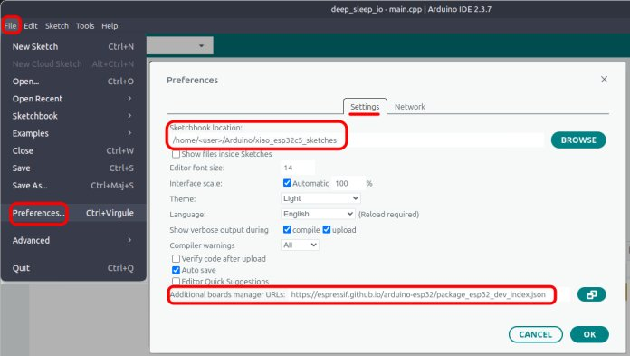

# XIAO ESP32C5 Sketches

*January 26, 2026*

**Arduino source code that accompanies [First Look at the Seeed Studio XIAO ESP32C5](https://sigmdel.ca/michel/ha/xiao/xiao_esp32c5_intro_en.html)**. 

---

**Table of Content**
<!-- TOC -->

- [1. Introduction](#1-introduction)
- [2. Compiling the Example Sketches](#2-compiling-the-example-sketches)
  - [2.1. Arduino IDE](#21-arduino-ide)
  - [2.2. pioarduinoIDE](#22-pioarduinoide)
- [3. Sketches/Projects](#3-sketchesprojects)
  - [3.1. ./01_info](#31-01_info)
  - [3.2. ./02_digital_io](#32-02_digital_io)
  - [3.3. ./03_adc_in](#33-03_adc_in)
  - [3.4. ./04_sleep](#34-04_sleep)
  - [3.5. ./05_serial](#35-05_serial)
  - [3.6. ./06_wifi](#36-06_wifi)
  - [3.7. ./07_zibgee](#37-07_zibgee)
  - [3.8. ./08_bluetooth](#38-08_bluetooth)
- [4. Change Log](#4-change-log)
- [5. License](#5-license)

<!-- /TOC -->

## 1. Introduction

The [XIAO ESP32C5](https://www.seeedstudio.com/Seeed-Studio-XIAO-ESP32C5-p-6609.html) is a recent addition (Jan 16, 2026) to the [Seeed Studio XIAO series](https://www.seeedstudio.com/xiao-series-page) of diminutive development boards. As with the other boards in the XIAO ESP32Cx series, it is based on a RISC-V SoC.

## 2. Compiling the Example Sketches

Each sketch or project in this repository is presented in a way that allows it to be compiled in the Arduino IDE or in the pioarduino IDE or the PlatformIO IDE extensions. 

To compile a sketch in the Arduino IDE click on the **Open** option in the **File** menu and navigate to and select the desired file with the `.ino` extension with the system file manager. Alternately, click on the **Sketchbook** option and navigate to the desired sketch in the sub-menu tree ([screen capture](images/arduino_sketchbook.jpg)). The IDE must be configured as explained in the [Arduino IDE](#21-arduino-ide) section below.

To compile a project in the piaorduino IDE extension (or maybe the PlatformIO IDE), click on the home icon in the status bar at the bottom, then on the **[Open Project]** button and then navigate to the project's directory which contains its `platformio.ini` file. Click on the **[Open "&lt;project&gt;"]** button. The IDE must be configured as explained in the [pioarduinoIDE](#22-pioarduinoide) section below.

### 2.1. Arduino IDE 

The latest version of the Arduino IDE can be obtained for Windows, Linux and macOS in the [Downloads](https://www.arduino.cc/en/software) page from Arduino. Install the latest Espressif ESP32 Arduino core. 

 1. Add https://espressif.github.io/arduino-esp32/package_esp32_index.json in the Additional Boards Manager URLS in the Preferences window in the IDE.
  
 1. Using the Boards Manager, install platform `esp32` by Espressif, version 3.3.6 or newer. All sketches compiled and ran correctly with version 3.3.5 but error messages would be printed to the serial monitor when switching between the 2.4 and 5 GHz Wi-Fi bands, for example. This no longer occurs since 3.3.6-RC1.

This is a one-time task.

When compiling a sketch from this repository 

 1. Select the `XIAO_ESP32C5` board in the `Tools` menu of the IDE when compiling a project. The default values for the other options in the menu are acceptable except for the Zigbee sketches. See their respective README for details.

 1. Set the directory containing the downloaded repository as the sketchbook location in the IDE **Preferences** settings. 
      - This must be done or else the `MACs` library will not be found and most sketches will not compile.
      - Keep track of the old sketchbook location before changing it.  
      - Reset the sketchbook location to its old value when done.
       

When the repository is downloaded as an archive, its top-level directory is named `xiao_esp32c5_sketches-main`. The last bit, which identifies the git branch, was removed because there's only one branch in this repository. 

### 2.2. pioarduinoIDE

All of the sketches in the repository have been successfully compiled with the [pioarduino-espressif32](https://github.com/pioarduino/platform-espressif32) platform. The January 21, 2026 version of [pioarduino/platform-espressif Release 55.03.36 Arduino Release v3.3.6 based on ESP-IDF v5.5.2.260116](https://github.com/pioarduino/platform-espressif32/releases/tag/55.03.36) was used. 

The platform does not contain a board definition for the XIAO ESP32C5. A board definition, named [seeed_xiao_esp32c5.json](boards/seeed_xiao_esp32c5.json), is provided in the `boards` directory. See thee [README](boards/README.md) about the source of that definition.

**The `platformio.ini` configuration file in all the example sketches of the repository set the values `platform` and `board` to those shown above.** 

This was tested using the [pioarduinoIDE extension](https://marketplace.visualstudio.com/items?itemName=pioarduino.pioarduino-ide) (v1.2.5) which is a fork of the PlatformioIDE extension in [VSCodium](https://vscodium.com/) (Version: 1.108.10359) which is itself a fork of Visual Studio Code. The PlatformioIDE extension is not available in the VSCodium marketplace and manual installation of its VSIX is not possible because it's not readily found anymore.

> In principle, it should be possible to use the [Seeed-Studio platform-seeedboards](https://github.com/Seeed-Studio/platform-seeedboards) platform instead of the pioarduino platform-espressif32 in either the pioarduinoIDE or PlatformioIDE extensions. However it was somewhat difficult, but not impossible, to do that in cursory tests because of missing libraries in the Python virtual environment. Also, the XIAO ESP32C5 board definition in the Seeed Studio platform does seem to contain errors. Details may be provided in the [First Look at the Seeed Studio XIAO ESP32C5](https://sigmdel.ca/michel/ha/xiao/xiao_esp32c5_intro_en.html) post or in a follow-up post.

## 3. Sketches/Projects

The sketches are grouped into categories. It should be easier to add or delete individual sketches with reduced impact on the numbering system.

### 3.1. ./01_info

Contains 3 sketches that print information to the serial monitor.

 | Project | Description |
 | :--- |  :--- |
 | *sys_info* | Display some information about the ESP32 system.|
 | *pin_names* | Display the mapping of XIAO ESP32C5 Arduino pin names to gpio numbers and some useful macros. |
 | *macs* | Prints out MAC addresses.  |

### 3.2. ./02_digital_io

Contains 4 sketches that verify the digital input and output capabilities of all the pins on the board. 

 | Project | Description |
 | :--- |  :--- |
 | *blink* | Blinks every pin around a XIAO ESP32C5 board in a heartbeat pattern. |
 | *pwm* | Pulses every pin around a XIAO ESP32C5 board using pulse width modulation.|
 | *poll* | Test polling of all the i/o pins of the XIAO ESP32C5.|
 | *interrupt* | Test the interrupt capability of all the i/o pins of the XIAO ESP32C5.|

### 3.3. ./03_adc_in

Contains 2 sketches that look at the analogue input capabilities of all the pins on the board.

 | Project | Description |
 | :--- |  :--- |
 | *adc* | Testing the analog input pins of the XIAO ESP32C5.|
 | *adc-dvm* | Measuring the A0 analog input of the XIAO ESP32C5.|

### 3.4. ./04_sleep

Contains 2 sketches that test 2 methods to wake the ESP32-C5 from a deep sleep state. 

 | Project | Description |
 | :--- |  :--- |
 | *deep_sleep_tmr* |  Wake XIAO ESP32C5 from deep sleep mode with timer.|
 | *deep_sleep_io* | Wake the XIAO ESP32C5 from deep sleep mode with a high or low signal to i/o pins.| 

### 3.5. ./05_serial

Contains 2 sketches with loopback tests of the UART and SPI peripherals.

 | Project | Description |
 | :--- |  :--- |
 | *uart* | UART loopback test.|
 | *spi* | SPI loopback test. |

### 3.6. ./06_wifi

Contains 3 sketches highlighting the 5 GH band capability of the ESP32-C5.

 | Project | Description |
 | :--- |  :--- |
 | *scan* | Scan Wi-Fi networks combining and segregating 2.4 GHz and 5 GHz bands.|
 | *wifi_connect* | Connect to 2.4 GHz or 5 GHz band Wi-Fi network with XIAO ESP32C5 using BSSID. |
 | *throughput* | Measure the Wi-Fi download speed on 2.4 GHz and 5 GHz bands of a XIAO ESP32C5. |
 
### 3.7. ./07_zibgee

Contains examples from the ESP32 Arduino Zigbee library modified to work with the XIAO ESP32C5 and XIAO ESP32C6 using their boot button and on-board user LED.

 | Project | Description |
 | :--- |  :--- |
 | *Zigbee_On_Off_Switch* | Create a Zigbee coordinator |
 | *Zigbee_On_Off_Light* | Create a Zigbee on/off light end device |
 | *Zigbee_Dimmable_Light* | Create a Zigbee dimmable light end device |
  
### 3.8. ./08_bluetooth

Contains examples from the ESP32 Arduino Zigbee library modified to work with the XIAO ESP32C5 and XIAO ESP32C6<:>

 | Project | Description |
 | :--- |  :--- |
 | *ble_scan* | Library example (Scan.ino)  |
 | *server* | Library example (Server.ino)  |
 | *client* |  Library example (Client.ino)  |

## 4. Change Log

| Date | Change |
| :---  |  :--- | 
| 2026-01-26 | Added 3rd Zigbee example and tweaked README |
| 2026-01-26 | Board definition, improved README on Arduino IDE, pioarduino IDE and platforms |
| 2026-01-22 | PlatformIO/pioarduino support and MACs changed into a private library |
| 2026-01-21 | Corrections and README update |
| 2026-01-20 | Sleep sketches |
| 2026-01-19 | Link to post and corrections to readmes|
| 2026-01-17 | Initial version |

## 5. License

Copyright 2026 Michel Deslierres. No rights reserved. 

While the copyright pertaining to included libraries must be respected, all the code by Michel Deslierres in this repository is in the public domain. In those jurisdictions where this may be a problem, the [BSD Zero Clause License](https://spdx.org/licenses/0BSD.html) applies.
