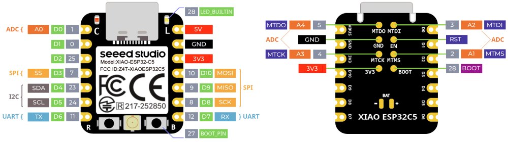

# XIAO ESP32C5 Sketches

*January 19, 2026*

**Arduino source code that accompanies [First Look at the Seeed Studio XIAO ESP32C5](https://sigmdel.ca/michel/ha/xiao/xiao_esp32c5_intro_en.html)**. 

---

## Introduction

The [XIAO ESP32C5](https://www.seeedstudio.com/Seeed-Studio-XIAO-ESP32C5-p-6609.html) is a recent addition (Jan 16, 2026) to the [Seeed Studio XIAO series](https://www.seeedstudio.com/xiao-series-page) of diminutive development boards. As with the other ESP32-C series SoC it is  based on a RISC-V core.

## PlatformIO Notes

None of the projects have been tested in PlatformIO yet. However the directory structure and file names are such that it should be relatively easy to use PlatformIO. 
Because of the Arduino sketch naming constraints, the `main.cpp` file of a project is not stored in the default `src` directory. A `src_dir` entry in the `platformio.ini` configuration file provides the name of the directory in which `main.cpp` is found. 

## Arduino IDE Notes

The latest version of the Arduino IDE can be obtained for Windows, Linux and macOS in the [Downloads](https://www.arduino.cc/en/software) page from Arduino. 

Install the latest Espressif ESP32 Arduino core. 

 1. Add https://espressif.github.io/arduino-esp32/package_esp32_index.json in the Additional Boards Manager URLS in the Preferences window in the IDE.
  
 1. Install platform `esp32` by Espressif, version 3.3.5 or newer, with the Boards Manager. The only error in the esp32-arduino core that occurred in all the sketches has been fixed in version 3.3.6-RC1. However the sketches have not been run against this release candidate. There may be regression errors. Since the single error encountered in 3.3.5 does not impact the functioning of the sketches, it may be better to wait for the stable release of version 3.3.6.
 
 1. Select the `XIAO_ESP32C5` board in the `Tools` menu of the IDE when compiling a project.

Arduino sketches must have an `.ino` file name extension and must be contained in a directory that has the same name as the Arduino sketch (excluding the extension). Consequently the `01_pin_names` project contains a directory named `pin_names` that in turn contains the Arduino sketch `pin_names.ino`. That sketch is basically empty as it is a long comment only. This is not a problem because the Arduino IDE will import all source files found in the sketch directory. The actual code is in `main.cpp` which is the default name of a PlatformIO project.

## Change Log

| Date | Change |
| :---  |  :--- | 
| 2026-01-19 | Link to post and corrections to readmes|
| 2026-01-17 | Initial version |

## License

Copyright 2026 Michel Deslierres. No rights reserved. 

While the copyright pertaining to included libraries must be respected, all the code by Michel Deslierres in this repository is in the public domain. In those jurisdictions where this may be a problem, the [BSD Zero Clause License](https://spdx.org/licenses/0BSD.html) applies.
