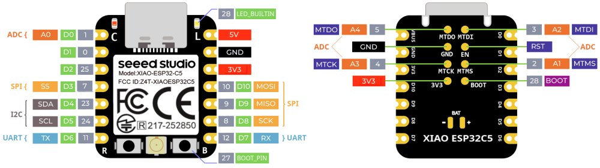
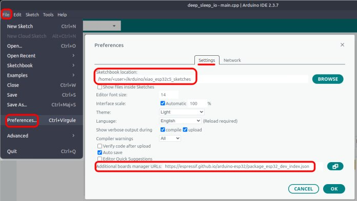

# XIAO ESP32C5 Sketches

*February 19, 2026*

**Arduino source code that accompanies [First Look at the Seeed Studio XIAO ESP32C5](https://sigmdel.ca/michel/ha/xiao/xiao_esp32c5_intro_en.html)**. 

---

**Table of Content**
<!-- TOC -->

- [1. Introduction](#1-introduction)
- [2. Compiling the Example Sketches](#2-compiling-the-example-sketches)
  - [2.1. Arduino IDE](#21-arduino-ide)
  - [2.2. pioarduinoIDE](#22-pioarduinoide)
- [3. Sketches/Projects](#3-sketchesprojects)
  - [3.1. ./01_info](#31-01_info)
  - [3.2. ./02_digital_io](#32-02_digital_io)
  - [3.3. ./03_adc_in](#33-03_adc_in)
  - [3.4. ./04_sleep](#34-04_sleep)
  - [3.5. ./05_serial](#35-05_serial)
  - [3.6. ./06_wifi](#36-06_wifi)
  - [3.7. ./07_zibgee](#37-07_zibgee)
  - [3.8. ./08_bluetooth](#38-08_bluetooth)
  - [3.9. Thread and Matter](#39-thread-and-matter)
- [4. Change Log](#4-change-log)
- [5. License](#5-license)

<!-- /TOC -->

## 1. Introduction

The [XIAO ESP32C5](https://www.seeedstudio.com/Seeed-Studio-XIAO-ESP32C5-p-6609.html) is a recent addition (Jan 16, 2026) to the [Seeed Studio XIAO series](https://www.seeedstudio.com/xiao-series-page) of diminutive development boards. As with the other boards in the XIAO ESP32Cx series, it is based on a RISC-V SoC.

## 2. Compiling the Example Sketches

Each sketch or project in this repository is presented in a way that allows it to be compiled in the Arduino IDE or in the pioarduino IDE or the PlatformIO IDE extensions. 

To compile a sketch in the Arduino IDE click on the **Open** option in the **File** menu and navigate to and select the desired file with the `.ino` extension with the system file manager. Alternately, click on the **Sketchbook** option and navigate to the desired sketch in the submenu tree ([screen capture](images/arduino_sketchbook.jpg)). The IDE must be configured as explained in the [Arduino IDE](#21-arduino-ide) section below.

To compile a project in the piaorduino IDE extension (or maybe the PlatformIO IDE), click on the home icon in the status bar at the bottom, then on the **[Open Project]** button and then navigate to the project's directory which contains its `platformio.ini` file. Click on the **[Open "&lt;project&gt;"]** button. The IDE must be configured as explained in the [pioarduinoIDE](#22-pioarduinoide) section below.

### 2.1. Arduino IDE 

The latest version of the Arduino IDE can be obtained for Windows, Linux and macOS in the [Downloads](https://www.arduino.cc/en/software) page from Arduino. Install the latest Espressif ESP32 Arduino core. 

 1. Add https://espressif.github.io/arduino-esp32/package_esp32_index.json in the Additional Boards Manager URLS in the Preferences window in the IDE.
  
 1. Using the Boards Manager, install platform `esp32` by Espressif, version 3.3.6 or newer. 

This is a one-time task.

When compiling a sketch from this repository 

 1. Select the `XIAO_ESP32C5` board in the `Tools` menu of the IDE when compiling a project. The default values for the other options in the menu are acceptable except for the Zigbee sketches. See their respective README for details.

 1. Set the directory containing the downloaded repository as the sketchbook location in the IDE **Preferences** settings. 
      - This must be done or else the `MACs` library will not be found and most sketches will not compile.
      - Keep track of the old sketchbook location before changing it.  
      - Reset the sketchbook location to its old value when done.
       

When the repository is downloaded as an archive, its top-level directory is named `xiao_esp32c5_sketches-main`. The last bit, which identifies the git branch, was removed because there's only one branch in this repository. 

### 2.2. pioarduinoIDE

All of the sketches in the repository have been successfully compiled with the [pioarduino-espressif32](https://github.com/pioarduino/platform-espressif32) platform. The January 21, 2026 version of [pioarduino/platform-espressif Release 55.03.36 Arduino Release v3.3.6 based on ESP-IDF v5.5.2.260116](https://github.com/pioarduino/platform-espressif32/releases/tag/55.03.36) was used initially. All projects should compile without problems with the newest version of the platform (55.03.37 based on v3.3.7 of the ESP32 Arduino core) but this has been tested with only a few projects.

The stable release of the platform does not yet contain a board definition for the XIAO ESP32C5. A [seeed_xiao_esp32c5.json](boards/seeed_xiao_esp32c5.json) manifest is available in the `develop` branch of the platform. A local copy is provided in the `boards` directory to use with the current stable release (see the [boards/README](boards/README.md) for more information). 

Many projects use a local `MACs` library function or macro to print out an interface MAC address. The library is in the `libraries` directory.

The correct values of the `platform`, `framework`, `boards_dir`, `lib_dir` and `src_dir` parameters are defined in the `platformio.ini` configuration file of each example project in the repository. Each project should compile *as is* in the pioarduinoIDE so long as the directory structure is not changed which requires including the `boards` and `libraries` directories.

This was tested using the [pioarduinoIDE extension](https://marketplace.visualstudio.com/items?itemName=pioarduino.pioarduino-ide) (v1.2.5) which is a fork of the PlatformioIDE extension in [VSCodium](https://vscodium.com/) (Version: 1.108.10359) which is itself a fork of Visual Studio Code. Note that the PlatformioIDE extension is not available in the VSCodium marketplace and its manual installation is not easily done because the VSIX package is not readily found anymore.

## 3. Sketches/Projects

The sketches are grouped into categories. It should be easier to add or delete individual sketches with reduced impact on the numbering system.

### 3.1. ./01_info

Contains 3 sketches that print information to the serial monitor.

 | Project | Description |
 | :--- |  :--- |
 | *sys_info* | Display some information about the ESP32 system.|
 | *pin_names* | Display the mapping of XIAO ESP32C5 Arduino pin names to gpio numbers and some useful macros. |
 | *macs* | Print out MAC addresses.  |
 | *heap* | Investigate the heap. |

### 3.2. ./02_digital_io

Contains 4 sketches that verify the digital input and output capabilities of all the pins on the board. 

 | Project | Description |
 | :--- |  :--- |
 | *blink* | Blinks every pin around a XIAO ESP32C5 board in a heartbeat pattern. |
 | *pwm* | Pulses every pin around a XIAO ESP32C5 board using pulse width modulation.|
 | *poll* | Test polling of all the i/o pins of the XIAO ESP32C5.|
 | *interrupt* | Test the interrupt capability of all the i/o pins of the XIAO ESP32C5.|

### 3.3. ./03_adc_in

Contains 2 sketches that look at the analogue input capabilities of all the pins on the board.

 | Project | Description |
 | :--- |  :--- |
 | *adc* | Testing the analog input pins of the XIAO ESP32C5.|
 | *adc-dvm* | Measuring the A0 analog input of the XIAO ESP32C5.|

### 3.4. ./04_sleep

Contains 2 sketches that test 2 methods to wake the ESP32-C5 from a deep sleep state. 

 | Project | Description |
 | :--- |  :--- |
 | *deep_sleep_tmr* |  Wake XIAO ESP32C5 from deep sleep mode with timer.|
 | *deep_sleep_io* | Wake the XIAO ESP32C5 from deep sleep mode with a high or low signal to i/o pins.| 

### 3.5. ./05_serial

Contains 2 sketches with loopback tests of the UART and SPI peripherals.

 | Project | Description |
 | :--- |  :--- |
 | *uart* | UART loopback test.|
 | *spi* | SPI loopback test. |

### 3.6. ./06_wifi

Contains 3 sketches highlighting the 5 GH band capability of the ESP32-C5.

 | Project | Description |
 | :--- |  :--- |
 | *scan* | Scan Wi-Fi networks combining and segregating 2.4 GHz and 5 GHz bands.|
 | *wifi_connect* | Connect to 2.4 GHz or 5 GHz band Wi-Fi network with XIAO ESP32C5 using BSSID. |
 | *throughput* | Measure the Wi-Fi download speed on 2.4 GHz and 5 GHz bands of a XIAO ESP32C5. |
 | *wifi_connect_time* | Measure the time to connect to a Wi-Fi access point, the time to obtain a dynamic IP address and the signal strength of the wireless connection |
 
### 3.7. ./07_zibgee

Contains examples from the ESP32 Arduino Zigbee library modified to work with the XIAO ESP32C5 and XIAO ESP32C6 using their boot button and on-board user LED.

 | Project | Description |
 | :--- |  :--- |
 | *Zigbee_On_Off_Switch* | Create a Zigbee coordinator |
 | *Zigbee_On_Off_Light* | Create a Zigbee on/off light end device |
 | *Zigbee_Dimmable_Light* | Create a Zigbee dimmable light end device |
  
### 3.8. ./08_bluetooth

Contains examples from the ESP32 Arduino BLE library modified to work with the XIAO ESP32C5 and XIAO ESP32C6.

 | Project | Description |
 | :--- |  :--- |
 | *ble_scan* | Library example (Scan.ino)  |
 | *server* | Library example (Server.ino)  |
 | *client* |  Library example (Client.ino) |
 | *ble_switch* | Remote BLE switch based on Notify.ino |
 | *ble_light* | Remote BLE on/off light based on Client.ino |

### 3.9. Thread and Matter

It was not possible to meaningfully test the Thread and Matter capabilities of the XIAO ESP32C5. However, it is possible to compile and run the example sketches **File/Examples/OpenThread/CLI/ThreadScan.ino** and **File/Examples/OpenThread/CLI/SimpleNode.ino** on a couple of ESP32C5 boards. Just make sure to enable the "PSRAM" option in the `Tools` menu of the Arduino IDE in both cases. The simple Thread node will show up in the scan. If the simple node sketch is replaced with the **File/Examples/Matter/MatterOnOffLight.ino** sketch, the latter will be found by the scanner. Unfortunately, the Matter node can only be commissioned if it is connected to a Thread network which was not available. On the other hand, a XIAO ESP32C6 running the **MatterOnOffLight.ino** sketch could be commissioned because it communicates over a Wi-Fi network (see [Supported Targets](https://github.com/espressif/arduino-esp32/tree/master/libraries/Matter/examples/MatterOnOffLight#supported-targets)).

## 4. Change Log

| Date | Change |
| :---  |  :--- |
| 2026-02-19 | Minor improvements, and board definition now in `develop` branch of `platform-espressif32`
| 2026-02-13 | Added ble_light and ble_switch to control LED on one board with button on other board using Bluetooth LE |
| 2026-02-05 | Added heap example in ./01_info and information about Thread and Matter|
| 2026-02-01 | Added wifi_connect_time example in ./06_wifi |
| 2026-01-26 | Added 3rd Zigbee example in ./07_zigbee and tweaked README |
| 2026-01-26 | Board definition, improved README on Arduino IDE, pioarduino IDE and platforms |
| 2026-01-22 | PlatformIO/pioarduino support and MACs changed into a private library |
| 2026-01-21 | Corrections and README update |
| 2026-01-20 | Sleep sketches |
| 2026-01-19 | Link to post and corrections to readmes|
| 2026-01-17 | Initial version |

## 5. License

Copyright 2026 Michel Deslierres. No rights reserved. 

While the copyright pertaining to included libraries must be respected, all the code by Michel Deslierres in this repository is in the public domain. In those jurisdictions where this may be a problem, the [BSD Zero Clause License](https://spdx.org/licenses/0BSD.html) applies.
